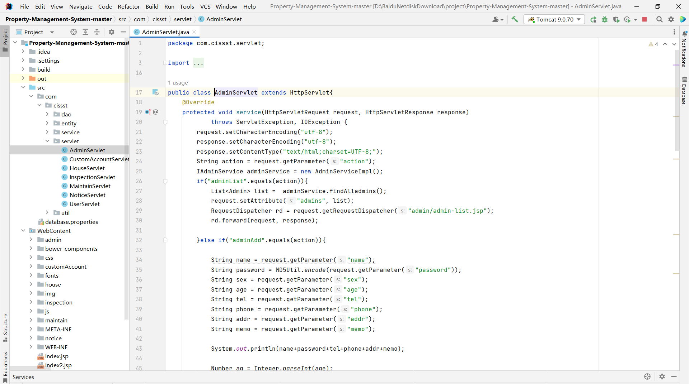
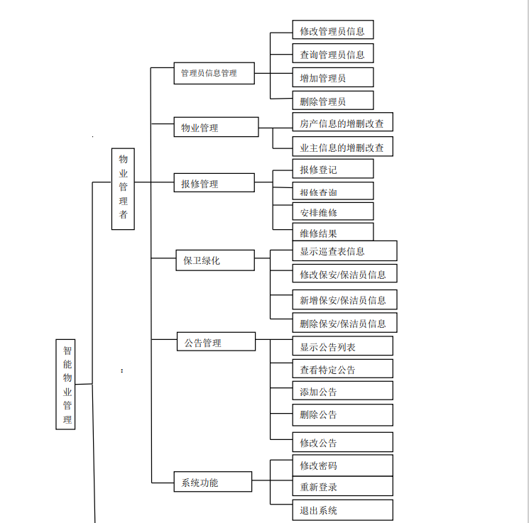
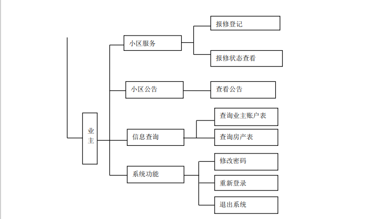
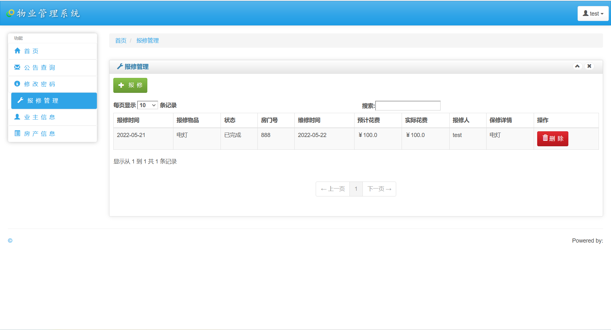
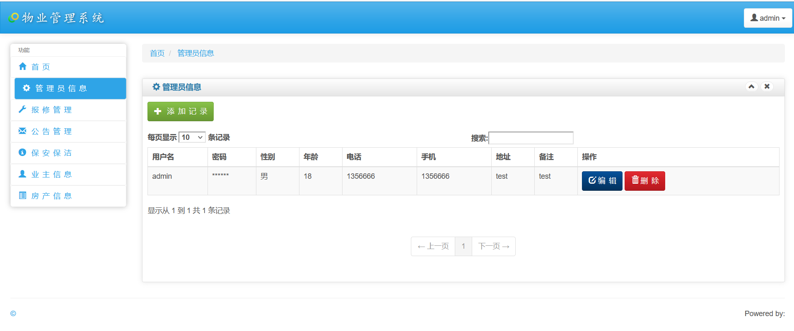
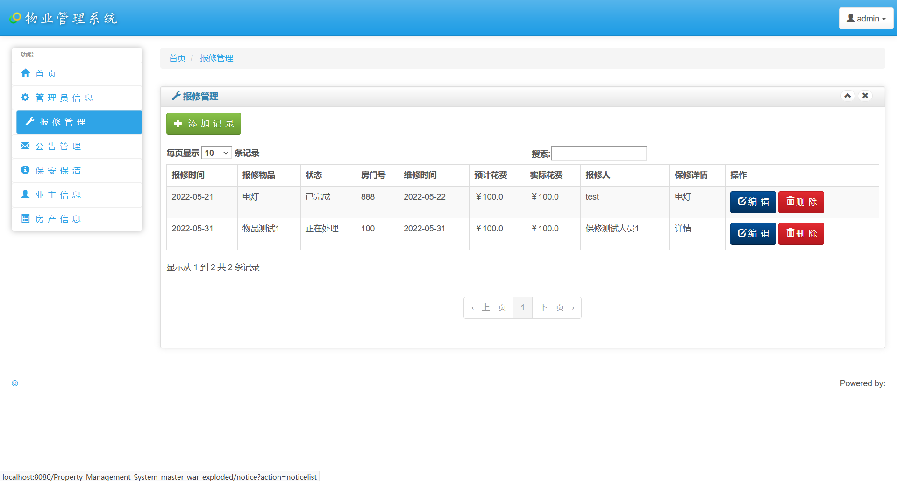
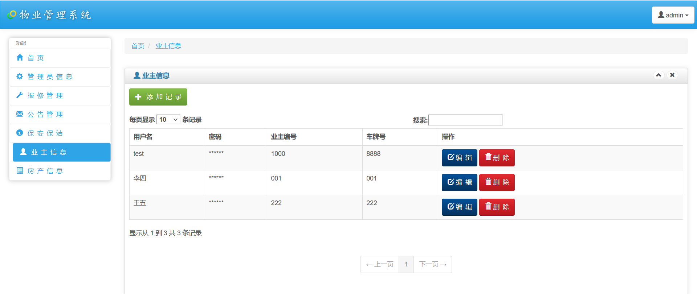

# 物业管理系统

### 有问题，或者需要协助调试运行项目的, 可以加QQ：2529519551，或者微信 ：xzxj0206 注明项目，“git+项目名称” ，如：“git学生宿舍管理系统”

### 更多项目： https://github.com/34426?tab=repositories

# 项目介绍
基于javaweb+mysql的小区物业管理系统(java+JSP+bootstrap+JavaScript+servlet+Mysql)

## 一、技术栈
java+JSP+bootstrap+JavaScript+servlet+Mysql

后端：Servlet

前端：JSP+CSS+JavaScript+jquery+bootstrap
## 二、项目功能介绍
本项目为后台管理系统，分为管理员与业主两种角色；

管理员主要功能包括：

1、首页，2、公告查询，3、修改密码，4、报修管理，5、业主信息，6、房产信息等；7、管理员可对业主、房产等信息进行增删改查，业主仅可查看；

业主主要功能包括：

1、首页，2、公告查询，3、修改密码，4、报修管理，5、业主信息，6、房产信息等；

## 三、业主功能部分页面展示

## 四、管理员功能部分页面展示

