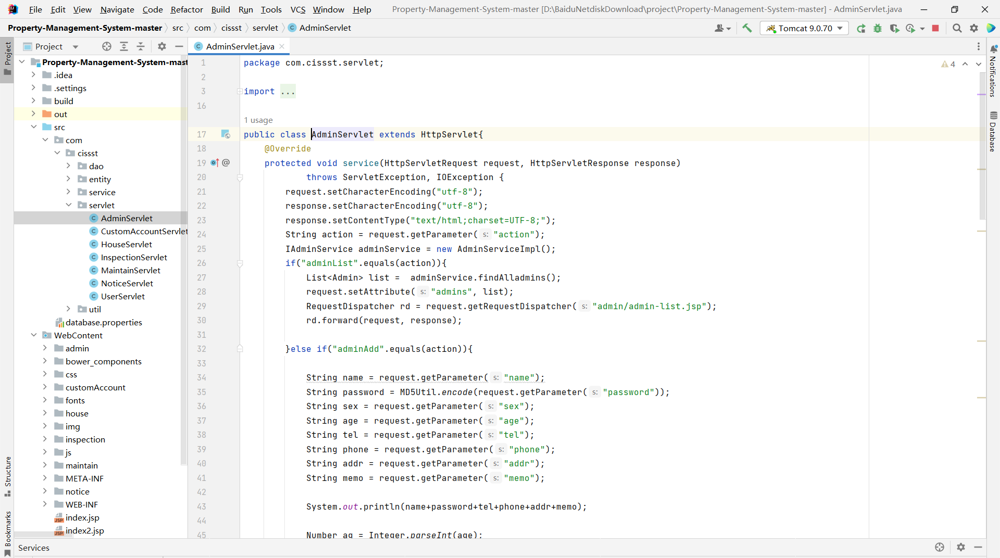
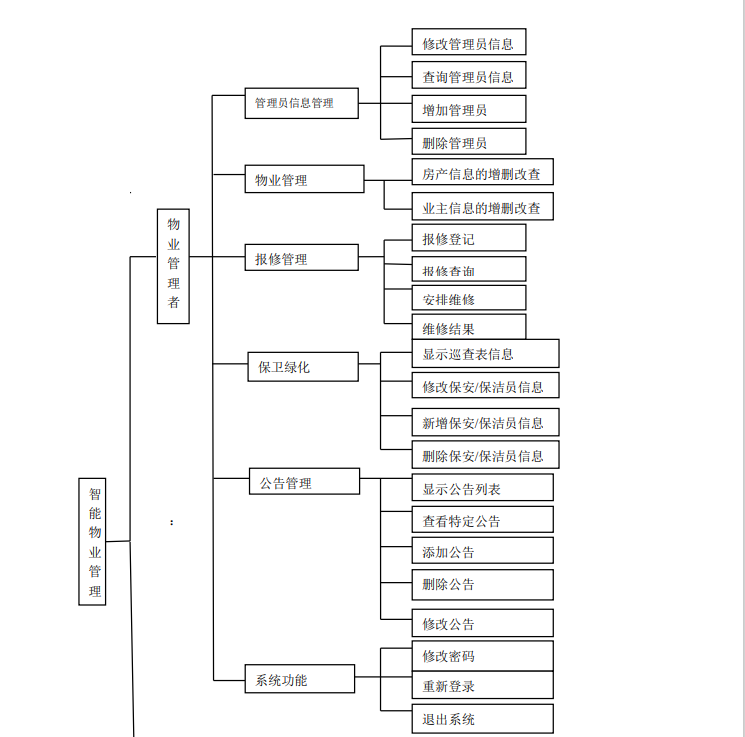
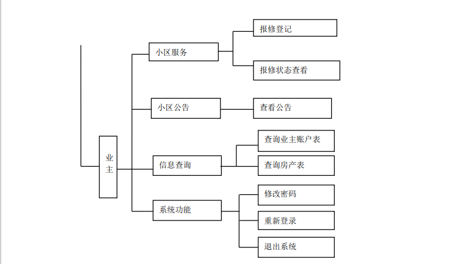
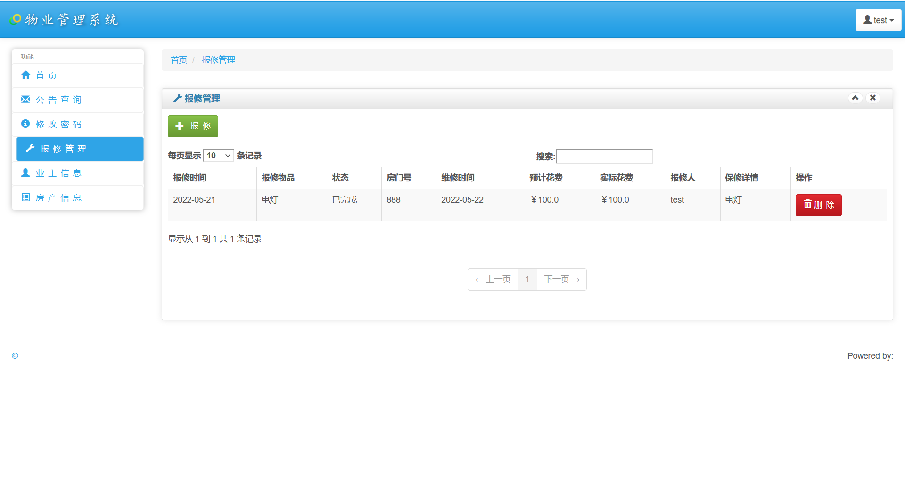
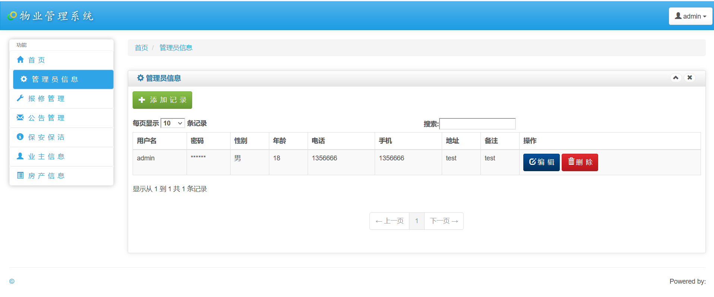
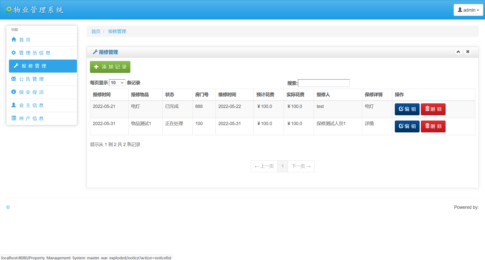
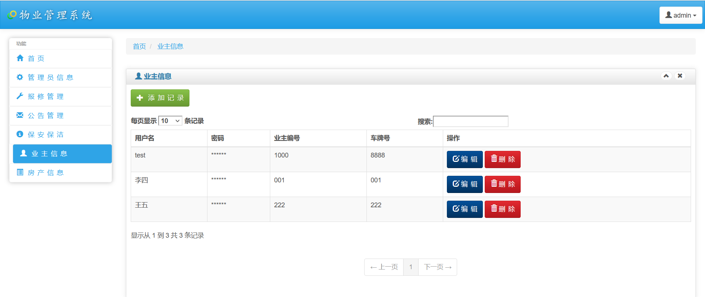

# 物业管理系统

### 完整项目获取

通过网盘分享的文件：物业管理系统

链接: https://pan.baidu.com/s/1QDz5mDBe_QrpKUAjbhwzUw?pwd=manh 提取码: manh
--来自百度网盘超级会员v3的分享

### 项目合集(项目不断更新中，包含java、vue、python、Android、微信小程序等项目)

链接: https://pan.baidu.com/s/1nY-zhvAK0CXYcn3g7LzQnQ?pwd=id3c 提取码: id3c
--来自百度网盘超级会员v3的分享

### 工具包

链接: https://pan.baidu.com/s/1YmdoJvkjoUjA75wvHLDZ6A?pwd=xm96 提取码: xm96
--来自百度网盘超级会员v3的分享

需要远程项目部署或项目修改和毕业设计也可联系（添加申请时请备注好来意）

### 远程调试部署联系方式

链接: https://pan.baidu.com/s/1W0dDcoZmayG0c7USJDYBYg?pwd=nqd7 提取码: nqd7
--来自百度网盘超级会员v3的分享

#### 这些项目一起发你了 可以分享给你需要的同学 调试可找我 也接二次修改和项目定制、毕业设计等

## 接毕业设计和论文

微信联系方式：xzxj0206  QQ：3808981644   (支持修改、 部署调试、 支持代做毕设)

接网站建设、小程序、H5、APP、各种系统等，单片机、嵌入式也可以做

选题+开题报告+任务书+程序定制+安装调试+论文+答辩ppt  都可以做

# 项目介绍
基于javaweb+mysql的小区物业管理系统(java+JSP+bootstrap+JavaScript+servlet+Mysql)

## 一、技术栈
java+JSP+bootstrap+JavaScript+servlet+Mysql

后端：Servlet

前端：JSP+CSS+JavaScript+jquery+bootstrap
## 二、项目功能介绍
本项目为后台管理系统，分为管理员与业主两种角色；

管理员主要功能包括：

1、首页，2、公告查询，3、修改密码，4、报修管理，5、业主信息，6、房产信息等；7、管理员可对业主、房产等信息进行增删改查，业主仅可查看；

业主主要功能包括：

1、首页，2、公告查询，3、修改密码，4、报修管理，5、业主信息，6、房产信息等；

## 三、业主功能部分页面展示

## 四、管理员功能部分页面展示

